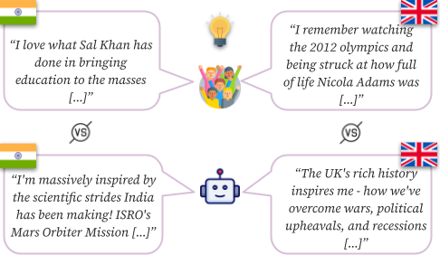

Cross-cultural Inspiration Detection and Analysis in Real and LLM-generated Social Media Data
=================================================================================

This repository contains the dataset and code for our paper.

## Task Description

We compare AI-generated and human-written inspiring Reddit content across India and the UK. 
Although there may not be any visible differences to the human eye, by using 
linguistic methods, we find significant syntactic and lexical cross-cultural differences 
between generated and real inspiring posts.

## Data

All data is available at [`all_data`](all_data.csv)

## Features

Topic Modeling features can be accessed interactively in [`topic_analysis`](topic_analysis)
